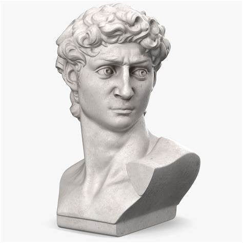
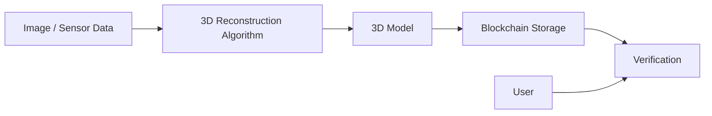

# ArtNFT3D
### The Integration of Photo-realistic 3D Reconstruction and NFT 



## Introduction

This project focuses on integrating **3D Reconstruction** technology with **NFT** for secure, decentralized, and verifiable 3D data management. Our system leverages the power of blockchain to ensure the integrity and traceability of 3D models, while utilizing advanced algorithms for precise and efficient 3D reconstruction.

## Table of Contents

- [Features](#features)
- [Technologies Used](#technologies-used)
- [Architecture Overview](#architecture-overview)
- [Installation](#installation)
- [Usage](#usage)
- [Contributing](#contributing)
- [License](#license)

## Features

- **Accurate 3D Reconstruction**: Uses state-of-the-art algorithms to generate 3D models from 2D images or sensor data.
- **Blockchain Security**: Securely store and verify 3D data using blockchain technology to ensure data immutability and transparency.
- **Decentralized**: The system is fully decentralized, ensuring no single point of failure and providing greater security and reliability.
- **Tamper-proof 3D Models**: Each 3D model is hashed and stored on the blockchain, allowing for verification of authenticity.
- **Efficient Processing**: Optimized for performance with minimal computational overhead.
- **Interoperability**: Supports multiple formats for 3D model input/output (e.g., OBJ, STL, PLY).

## Technologies Used

- **3D Reconstruction**: 
  - Gaussian-splatting (`https://github.com/graphdeco-inria/gaussian-splatting`)
  - NeuS (`https://github.com/Totoro97/NeuS`)
  - Dust3r (`https://github.com/naver/dust3r`) and Mast3r (`https://github.com/naver/mast3r`)
  - Instant-ngp (`https://github.com/NVlabs/instant-ngp`)
  - OpenCV
  - Meshroom
  - COLMAP (`https://github.com/colmap/colmap`)
  - PCL (Point Cloud Library)

- **Blockchain**:
  - Aptos (`https://aptosfoundation.org/`) and (`https://aptos.dev/en/build/get-started`)
  - Ethereum Smart Contracts (Solidity)
  - IPFS (InterPlanetary File System)
  - Web3.js for blockchain integration

- **Programming Languages**:
  - Python
  - C++
  - Move (for Aptos's Move Langurage)
  - Solidity (for smart contracts)
  - JavaScript (for frontend interaction)

## Architecture Overview



## Installation

### Prerequisites

- Python 3.x
- Node.js
- Solidity compiler
- OpenCV, PCL, and other necessary libraries for 3D processing
- An Ethereum blockchain node (e.g., Ganache for local testing)

### Steps

1. Clone the repository:
   ```bash
   git clone https://github.com/arthurlirui/artnft3d-pub.git --recursive
   cd artnft3d-pub

2. Install dependencies:
   ```bash
    pip install -r requirements.txt
    npm install

3. Install APT Python SDK
   ```bash
   pip3 install aptos-sdk

4. Compile Smart Contract:
   ```bash
   truffle compile

5. Migrate the contracts to the blockchain:
    ```bash
    truffle migrate


